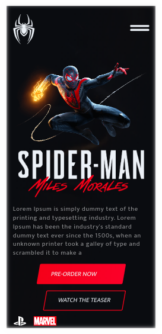

# Spider-man: Miles Morales

Esse projeto foi proporcionado pelo evento FrontWeek, conduzido pelo instrutor Násser Yousef Ali. Nele foi desenvolvido uma página com um tom mais entusiasta, representando o lançamento do jogo do Spider-man: Miles Morales.

**Veja o projeto online aqui**: [marcoskloss-spiderman-milesmorales.netlify.app](https://marcoskloss-spiderman-milesmorales.netlify.app/)

## Desktop

## Mobile

    
## Tecnologias utilizadas
   - HTML
   - SASS
   - JavaScript
### Bibliotecas
- GSAP
- SVGInject
- Tilt.js
#### Saiba mais sobre a minha experiência com esse projeto aqui:
[linkedin.com/marcoskloss/spider-man](https://www.linkedin.com/posts/marcos-kloss_finalizei-o-projeto-do-evento-frontweek-realizado-activity-6765435753188073472-RV7c)
